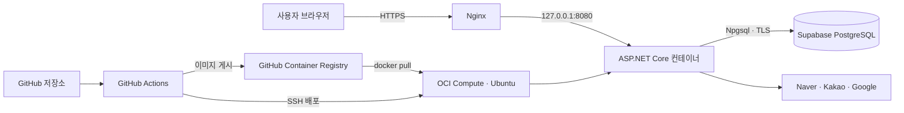
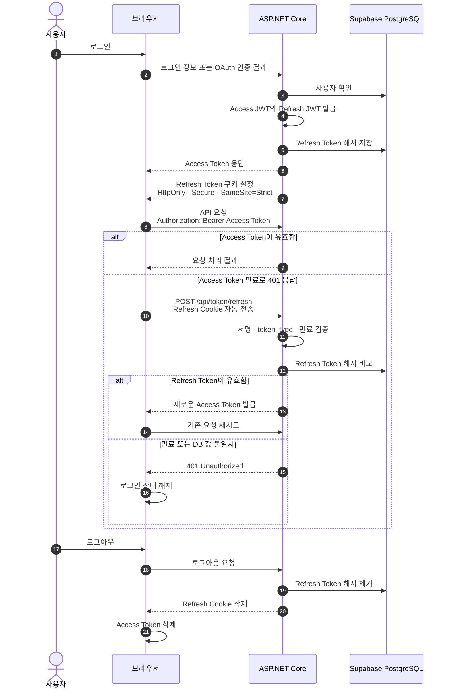
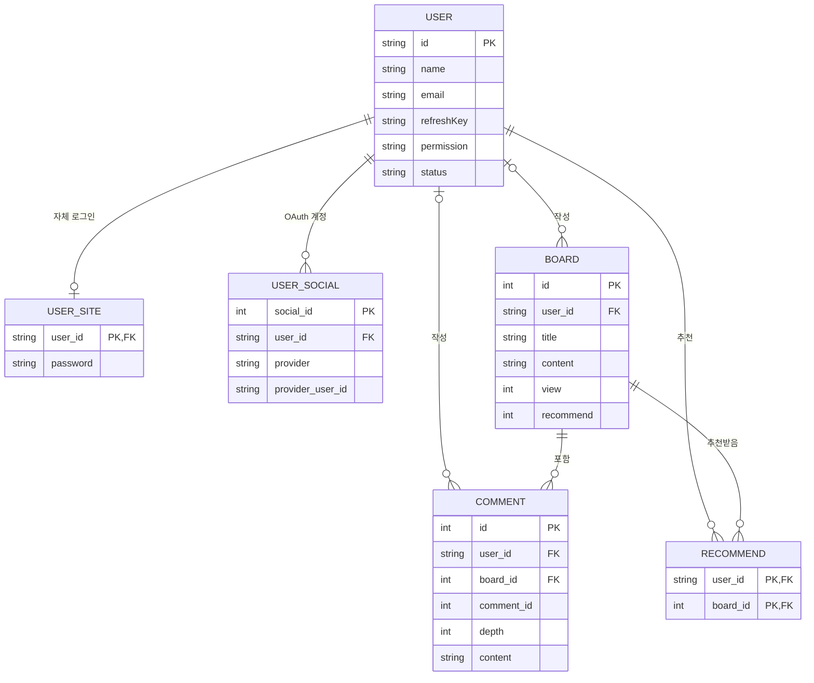

# Community_C

.NET 8과 Supabase PostgreSQL로 만든 커뮤니티 게시판 프로젝트입니다.

게시판 CRUD 자체보다 인증과 권한 검증, OAuth 계정 식별, 데이터 모델링, 테스트, 컨테이너 배포처럼 실제 백엔드 운영에서 필요한 문제를 직접 설계하고 검증하는 데 초점을 맞췄습니다.

- 운영 주소: [https://communityc.viewdns.net](https://communityc.viewdns.net)
- 컨테이너 이미지: `ghcr.io/mango125/community-c`
- 운영 환경: Oracle Cloud Infrastructure Compute · Ubuntu · Nginx · Docker
- 데이터베이스: Supabase PostgreSQL

## 1. 프로젝트 소개

회원이 게시글과 댓글을 작성하고 추천할 수 있는 ASP.NET Core MVC 게시판입니다. 자체 로그인과 Naver, Kakao, Google OAuth 로그인을 지원합니다.


이 프로젝트에서는 다음 문제를 중심으로 설계했습니다.

- 클라이언트가 전달한 사용자 ID를 신뢰하지 않는 인증 구조
- OAuth Access Token이 아닌 공급자 사용자 ID를 이용한 계정 식별
- Access Token과 Refresh Token의 역할 및 저장 위치 분리
- 테스트를 통과한 버전만 컨테이너 이미지로 배포하는 과정

본 프로젝트는 OpenAI Codex를 적극 활용했습니다.

- 프로젝트의 기본 구조는 직접 설계했으며, Codex는 세부 구현과 반복적인 검토 과정에 활용했습니다.
- 보안 및 UI/UX 개선, 테스트 작성, Docker·CI/CD 구성, 공개 저장소 전환과 문서화 과정에서 Codex의 도움을 받았습니다.
- 제안된 내용을 그대로 적용하지 않고, 프로젝트 요구사항과 실제 코드에 맞게 검토·수정한 뒤 반영했습니다.
## 2. 주요 기능

### 2.1 게시판

- 게시글 목록, 페이징, 상세 조회 및 조회수 집계
- 게시글 작성과 본인 글 수정
- 댓글과 1단계 답글 작성
- 사용자별 게시글 추천 등록 및 취소
- 데스크톱과 모바일 화면을 고려한 반응형 UI

### 2.2 회원과 인증

- 이메일 기반 회원가입 및 로그인
- Naver, Kakao, Google OAuth 로그인
- 첫 OAuth 로그인 시 닉네임 설정 후 자동 로그인
- 마이페이지에서 닉네임 수정과 게시판 권한 확인
- Access JWT 재발급과 서버 측 Refresh Token 폐기

## 3. 기술 스택

| 구분 | 기술 |
| --- | --- |
| Backend | C# · .NET 8 · ASP.NET Core MVC |
| Data | Entity Framework Core 8 · Supabase PostgreSQL · Npgsql |
| Authentication | JWT Bearer · ASP.NET Core PasswordHasher · OAuth 2.0 |
| Frontend | Razor Views · Bootstrap · JavaScript |
| Test | xUnit · EF Core InMemory |
| Container | Docker multi-stage build · Docker Compose · GHCR |
| CI/CD | GitHub Actions · SSH deployment |
| Cloud | Oracle Cloud Infrastructure Compute · Supabase |
| Production | Ubuntu · Nginx · HTTPS |
| Development | Visual Studio · OpenAI Codex |

## 4. 시스템 설계

### 4.1 전체 구성



애플리케이션 컨테이너는 외부에 직접 노출하지 않고 호스트의 `127.0.0.1:8080`에만 바인딩합니다. Nginx가 HTTPS 요청을 받아 컨테이너로 전달합니다.

### 4.2 클라우드 인프라

- **Oracle Cloud Infrastructure Compute**: Ubuntu 인스턴스에서 Nginx와 Docker를 운영합니다. Nginx가 HTTPS 요청을 처리하고 내부의 ASP.NET Core 컨테이너로 전달하며, GitHub Actions는 SSH로 접속해 GHCR의 버전 이미지를 배포합니다.
- **Supabase**: 관리형 PostgreSQL 데이터베이스로 사용합니다. 애플리케이션은 EF Core와 Npgsql을 통해 TLS 연결하며, 접속 정보는 운영 서버의 환경변수 파일에만 보관합니다.

애플리케이션 실행 환경과 데이터베이스를 분리해 컨테이너를 교체해도 데이터가 영향을 받지 않도록 구성했습니다. Supabase Auth와 Storage는 사용하지 않으며, 회원 인증과 파일 처리는 애플리케이션에서 직접 구현했습니다.

### 4.3 JWT 인증 생명주기

현재 프로젝트의 Access Token과 Refresh Token은 모두 JWT이며, 사용 목적과 보관 위치가 다릅니다.



- Access Token은 기본 30분 동안 유효하며 `Authorization: Bearer` 헤더에 사용합니다.
- Refresh Token은 기본 7일 동안 유효하며 `HttpOnly`, `Secure`, `SameSite=Strict` 쿠키에 저장합니다.
- DB에는 Refresh Token 원문이 아닌 SHA-256 해시만 저장합니다.
- 재발급 시 새로운 Access Token만 발급하고 기존 Refresh Token은 만료 또는 로그아웃까지 유지합니다.

Access Token은 현재 브라우저의 `localStorage`에 저장합니다. Bearer 인증 흐름을 확인하기에는 단순하지만 XSS 공격에 노출될 수 있다는 한계가 있습니다. 실제 서비스 수준으로 확장한다면 메모리 저장이나 BFF 구조를 검토할 수 있습니다.

### 4.4 인증과 보안 원칙

- 사용자 ID는 클라이언트 입력이 아니라 검증된 JWT claim에서 가져옵니다.
- OAuth 계정은 Access Token이 아닌 `provider + provider_user_id` 조합으로 식별합니다.
- OAuth 요청의 `state`를 HttpOnly 쿠키와 비교하여 요청 위조를 확인합니다.
- POST 폼에는 Anti-forgery 검증을 적용합니다.
- 운영 로그에는 쿼리 문자열, 요청 본문, 쿠키, Authorization 헤더를 기록하지 않습니다.

### 4.5 데이터 모델



`User`는 공통 회원 정보를 담당합니다. `User_Site`에는 자체 로그인 비밀번호 해시를, `User_Social`에는 OAuth 공급자와 공급자 사용자 ID를 저장합니다.

- `User_Social(provider, provider_user_id)` 유니크 인덱스
- `Recommend(user_id, board_id)` 복합 기본 키
- nullable 권한 값과 알 수 없는 권한 값은 모두 읽기 전용으로 처리

## 5. 권한 정책

| `permission` 값 | 읽기 | 게시글·댓글·추천 쓰기 |
| --- | --- | --- |
| `null`, 공백 | 가능 | 불가능 |
| `writer` | 가능 | 가능 |
| 그 외의 값 | 가능 | 불가능 |

권한은 JWT에 넣지 않고 쓰기 요청마다 DB에서 조회합니다. 관리자가 권한을 변경하면 기존 Access Token을 다시 발급하지 않아도 다음 요청부터 변경된 권한이 적용됩니다.

## 6. 테스트

`Community_C.Tests`는 보안 경계와 회귀 가능성이 높은 동작을 중심으로 검증합니다.

- JWT claim 기반 게시글·댓글 작성자 결정
- 다른 사용자의 게시글 수정 차단
- 읽기 전용 사용자의 모든 게시판 쓰기 동작 차단
- Refresh Token 쿠키 보안 속성과 DB 해시 저장
- Access Token의 Refresh Token 용도 사용 차단
- 로그아웃 시 Refresh Token 해시 폐기
- OAuth state 누락 요청 차단
- Correlation ID 검증과 민감 쿼리 미기록
- 로그 파일 보존 정책

```bash
dotnet test csharp-crud-board.sln
```

## 7. 로컬 실행

### 7.1 요구 사항

- .NET 8 SDK
- PostgreSQL
- 선택 사항: Docker Desktop 또는 Docker Engine

### 7.2 애플리케이션 설정

설정 구조는 `Community_C/appsettings.Development.json`을 기준으로 합니다.

```json
{
  "ConnectionStrings": {
    "DefaultConnection": ""
  },
  "JwtSettings": {
    "Key": "",
    "Issuer": "Community_C",
    "Audience": "Community_C",
    "AccessTokenExpiryMinutes": 30,
    "RefreshExpiryDays": 7
  },
  "Logging": {
    "LogLevel": {
      "Default": "Information",
      "Microsoft.AspNetCore": "Warning"
    }
  },
  "OAuth": {
    "Naver": {
      "Id": "",
      "Secret": "",
      "Redirect_URL": ""
    },
    "Kakao": {
      "Id": "",
      "Secret": "",
      "Redirect_URL": ""
    },
    "Google": {
      "Id": "",
      "Secret": "",
      "Redirect_URL": ""
    }
  },
  "AllowedHosts": "*"
}
```

DB 비밀번호, JWT 서명 키, OAuth Secret 같은 실제 값은 파일에 작성하거나 커밋하지 않습니다. 개발 환경에서는 .NET User Secrets를 사용하고, 운영 환경에서는 서버의 환경변수 파일로 주입합니다.

현재 저장소에는 EF Core Migration이 포함되어 있지 않습니다. 실행 전 `Models`와 `DataContext` 매핑에 맞는 PostgreSQL 스키마가 준비되어 있어야 합니다.

### 7.3 애플리케이션 실행

```bash
cd Community_C
dotnet restore
dotnet run
```

## 8. Docker 실행

저장소 루트에서 환경변수 예제 파일을 복사하고 모든 placeholder를 실제 로컬 값으로 교체합니다.

```bash
cp Dockerfile/community-c.env.example Dockerfile/community-c.env
docker compose --file Dockerfile/compose.yaml up --build
```

애플리케이션은 `http://localhost:8080`에서 확인할 수 있습니다.

실제 환경변수 파일, `appsettings.Development.json`, 키 파일은 이미지에 복사되지 않습니다.

## 9. CI/CD

### 9.1 CI

`develop` 브랜치 Push와 Pull Request에서 다음 작업을 실행합니다.

```text
Restore → Release Build → Test → Docker Image Build
```

CI 단계에서는 컨테이너 이미지를 외부 Registry에 게시하지 않습니다.

### 9.2 이미지 게시 및 운영 배포

`v<major>.<minor>.<patch>` 형식의 태그를 Push하면 다음 순서로 배포합니다.

```text
Release Build & Test
→ Docker Image Build
→ GHCR에 버전 태그와 Commit SHA 태그 게시
→ GitHub Actions가 OCI Compute 운영 서버에 SSH 접속
→ 새 이미지 Pull 및 컨테이너 교체
→ 로컬 HTTP 상태 확인
→ 실패 시 직전 이미지로 롤백
```

수동 Publish 실행은 `manual` 이미지 태그만 게시하며 운영 서버에는 배포하지 않습니다.

Supabase 연결 정보와 JWT, OAuth 값은 OCI 서버의 환경변수 파일에만 저장합니다. GitHub에는 배포 접속에 필요한 값을 `production` Environment Secret으로 등록합니다.

## 10. 프로젝트 구조

```text
.
├─ Community_C/
│  ├─ Controllers/          MVC, API, OAuth 요청 처리
│  ├─ Models/               EF Core 엔티티와 설정 모델
│  ├─ Utility/
│  │  ├─ Logs/              요청 로그와 보존 정책
│  │  └─ Security/          토큰 종류와 게시판 권한 검증
│  ├─ Views/                Razor Views
│  └─ Dockerfile            애플리케이션 이미지 정의
├─ Community_C.Tests/       xUnit 보안·회귀 테스트
├─ Dockerfile/              Compose와 운영 배포 스크립트
└─ .github/workflows/       CI, 이미지 게시, SSH 배포
```

## 11. 구현하며 개선한 점

- OAuth 제공자 Access Token을 사용자 식별값으로 저장하던 구조를 `provider + provider_user_id`로 변경
- Refresh Token 원문 저장을 SHA-256 해시 저장 방식으로 변경
- Access Token과 Refresh Token의 용도 혼용을 `token_type` claim으로 차단
- 클라이언트 `user_id`를 신뢰하던 쓰기 요청을 JWT claim 기반으로 변경
- 게시글 권한과 작성자 소유권을 서버에서 각각 검증
- Docker 이미지에서 설정 파일과 키를 제거하고 런타임 환경변수로 분리
- OCI Compute의 애플리케이션 실행 계층과 Supabase PostgreSQL 데이터 계층을 분리
- 버전 태그 기반 이미지 게시와 상태 확인·롤백이 포함된 운영 배포 자동화

## 12. 보안 주의사항

다음 파일이나 값은 커밋하지 않습니다.

- DB 접속 문자열과 비밀번호
- JWT 서명 키
- OAuth Client Secret
- Refresh Token
- `.env`, 개인 키 및 인증서

실제 비밀값은 개발 환경에서는 .NET User Secrets, 운영 환경에서는 서버 환경변수 또는 별도 Secret Store로 관리합니다.
